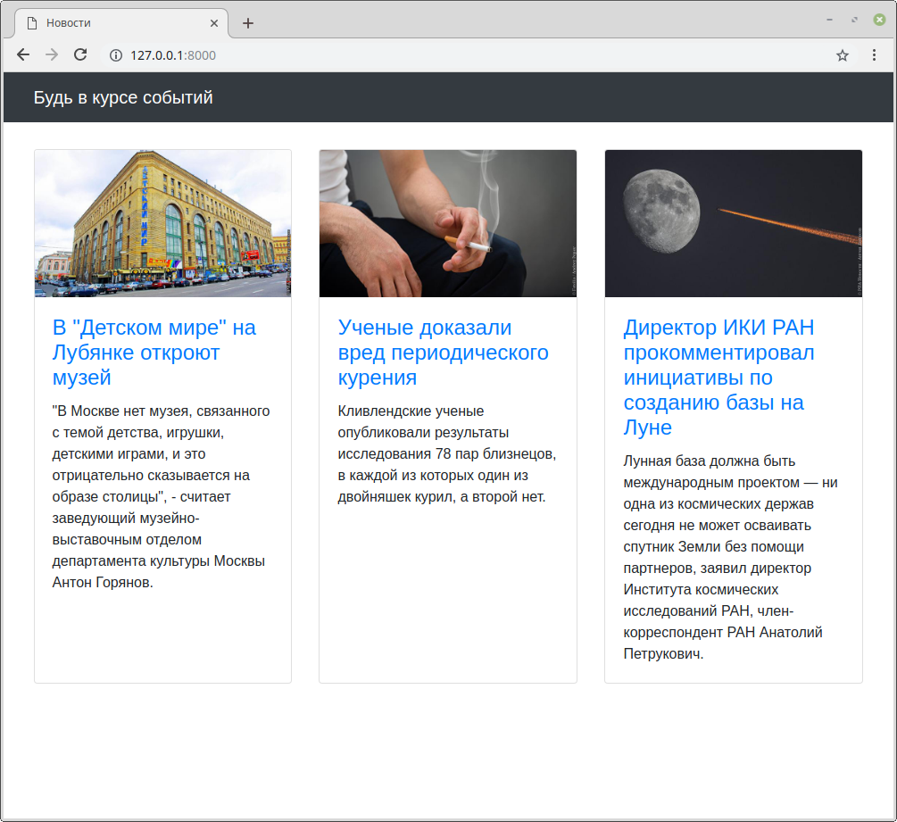

## Задание

Есть небольшой новостной сайт.

Было решено к статьям добавить тематические резделы, к которым они относятся, и отображать их у каждой новости в виде списка тегов.

У каждой статьи может быть несколько разделов, но всегда один из них должен быть основным.
В списке тегов он должен идти первым, потом все остальные в алфавитном порядке.

В админке необходимо реализовать создание разделов
и для страницы _Редактирование статьи_ добавить возможность указывать разделы.
Необходимо так же реализовать проверку на наличие одного и только одного основного раздела.

