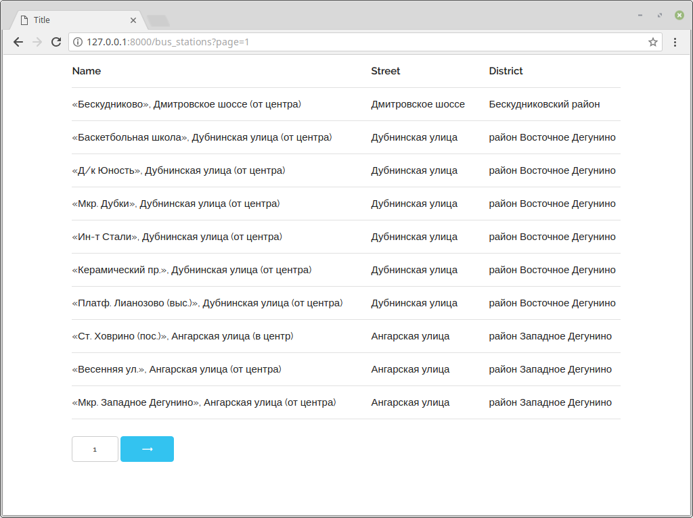

# Пагинация

## Задание

Реализуйте пагинацию по csv файлу с [портала открытых данных](https://data.mos.ru/datasets/752), содержащего список остановок наземного общественного транспорта.


* Реализована функция отображения `stations.views.bus_stations`.

* Путь к файлу хранится в настройках `settings.BUS_STATION_CSV`.

* Для чтения csv файла использовано [DictReader](https://docs.python.org/3/library/csv.html#csv.DictReader) файл в кодировке `utf-8`.



## Документация по проекту

Для запуска проекта необходимо:

Установить зависимости:

```bash
pip install -r requirements.txt
```

Выполнить команду:

```bash
python manage.py runserver
```
