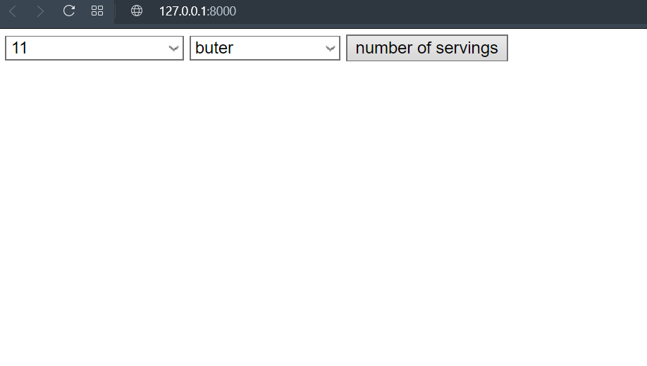
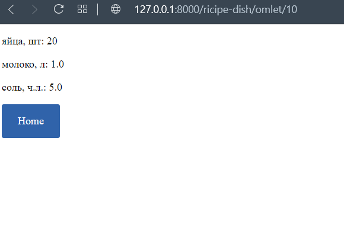

# Рецепты

## Задание

#### Написать простой сервис-помощник для приготовления блюд.

Сервис знает некоторое количество рецептов (см. файл `calculator/views.py` - переменная `DATA`).



На запрос вида `/omlet/` должен отобразиться список ингредиентов и их количество для приготовления омлета. Аналогично для запроса вида `/pasta/` - список ингредиентов и их количество для приготовления макарон с сыром. И т.д.




По умолчанию сервис сообщает количество ингредиентов на 1 порцию. Но если передать опциональный параметр `servings` (целое положительное число), то сервис должен выдать количество ингрелиентов на указанное число порций.
- Установить зависимости:

```bash
pip install -r requirements.txt
```

- Выполнить команду:

```bash
python manage.py runserver
```
